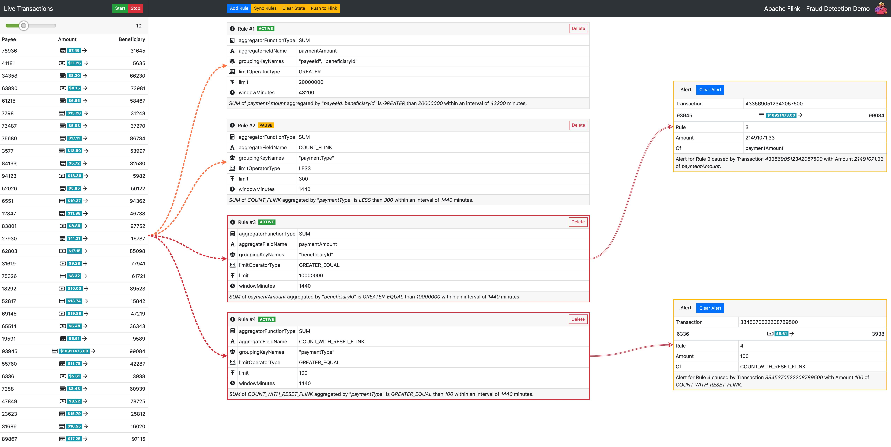

1. Fraud Dashboard (Good foundation)
4

You included:

Total alerts
Open alerts
Flagged
Declined
Fraud rate %

✔ This is exactly what operators need first glance

👉 Missing (important):

Trend over time (chart)
Alerts by rule
Alerts by terminal/BIN
2. Rules Engine UI (Very strong 👏)
8

You have:

Rule name
Type (VELOCITY / HIGH_AMOUNT)
Threshold
Window
Weight
Active flag

🔥 This is very good design

👉 What’s missing:

Severity (HIGH / MEDIUM / LOW)
Action (FLAG / DECLINE / BLOCK)
Rule priority / ordering
Edit rule (not only create)
3. Blacklist (Clean and correct)
6

You support:

Type (TERMINAL / BIN)
Value
Reason
Active

✔ This is correct

👉 Missing:

Expiry date ⛔ (very important)
Created by / timestamp
PAN support (masked)
4. Case Management (VERY GOOD 🔥)
8

You included:

Case ID
Alert ID
Status
Assigned to
Actions (activate/deactivate/delete)

✔ This is already enterprise-level thinking

👉 Missing:

Timeline (actions history)
Notes/comments
Attachments
Status flow (OPEN → INVESTIGATING → CLOSED)
5. Flagged Transactions (Excellent)
4

You included:

STAN / RRN
Decision (FLAG / DECLINE)
Risk score
Severity
Terminal
Amount
Rules triggered

🔥 This is exactly what real systems show

🚨 Critical Missing Pieces (Important)
❌ 1. No Alerts Screen (BIG GAP)

You skipped the most important screen:

👉 You need:

Alerts queue (NEW / REVIEWED)
Priority sorting
Real-time updates

Right now:

You jump directly to transactions

That’s not how fraud teams work.

❌ 2. No Real-Time Actions

From UI, I don’t see:

Block card
Block terminal
Approve transaction
Escalate alert

👉 Without actions → this is monitoring only, not control

❌ 3. No Risk Score Logic Visibility

You show:

Risk score = 91

But:
👉 HOW is it calculated?

You need:

Rule contribution
Score breakdown

Example:

Velocity: +30
High Amount: +40
Blacklist: +50
Total: 120 → capped at 100
❌ 4. No Fraud Decision Integration

UI shows:

FLAG
DECLINE

But missing:

👉 Is this coming from switch (jPOS) or UI logic?

Must be:

Backend (Java) → UI only displays

❌ 5. No Audit Trail

For banking, you MUST log:

Who created rule
Who blocked card
Who changed status
🧠 Architecture Check (Important)

Your UI implies this flow:

Rules → Score → Decision → UI

You must ensure:

👉 This logic is in backend (Java), NOT frontend

🎯 Final Score
Area	Score
UI Structure	9/10
Fraud Logic Design	7/10
Real-world readiness	6.5/10
🚀 What to Fix Next (Priority)
🔴 Must Do Immediately
Add Alerts screen
Add Action buttons (block / approve)
Add rule severity + action