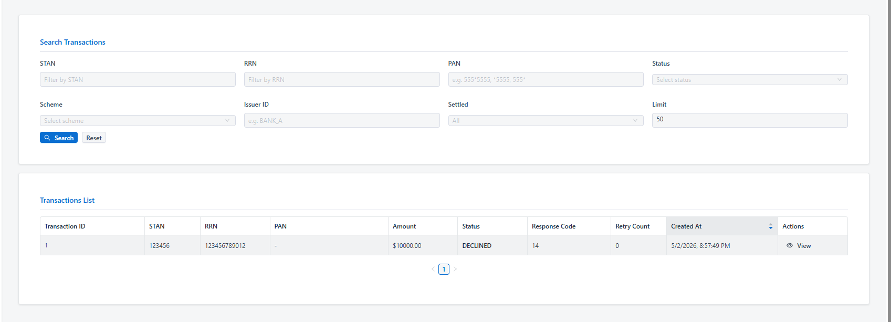

# Tasks

## Planned

## In Progress
  
## Done (recent)
- [x] write script to delete all jpos transaction and related tables but keep setting tables as is "no delete"

## Bugs
- [x] Add mandatory ISO8583 field validation before switch processing
- [x] pan field in table and view windows does not include pan number, it seems not stored correctly 
- [x] Reject 0200 transactions without PAN (F2)
- [x] PAN not appear correctly, the field is empty and here is the reponse from switch test  
        {
        "success": true,
        "request": {
            "mti": "0200",
            "fields": {
            "2": "1234567890123456",
            "3": "011000",
            "4": "000000010000",
            "11": "123456",
            "22": "021",
            "37": "123456789012",
            "41": "ATM0001"
            }
        },
        "response": {
            "mti": "0210",
            "rc": "00",
            "stan": "123456",
            "rrn": "123456789012",
            "fields": {
            "11": "123456",
            "37": "123456789012",
            "39": "00"
            }
        },
        "elapsed_ms": 16,
        "sent_at": "2026-05-02T19:53:53.949281+00:00",
        "profile": "atm"
        }
## Done
- [x] add default pan in switch test page 
- [x] add pan filter for (clear, masked) in trasaction page and fraud page 
- [x] filter must be wide card 555*5555 or *5555  or  555*
- [x] add pan number to transaction table as masked and show it clear in view -> details
- [x] Persist switch test transactions in PostgreSQL
- [x] Display switch response history
- [x] test transactions appear in transactions table 
- [x] test fraud transaction appear in fraud table   
- [x] Add `created_at` column to transaction list table in `frontend/src/pages/Transactions.jsx`
- [x] Ensure switch test transactions appear in transaction page — "View in Transactions" button in response panel navigates to Transactions page with STAN shown
- [x] Ensure fraud test transactions appear in fraud page — "View Fraud Alerts" button shown when fraud profile is selected
- [x] Add raw ISO request/response viewer — collapsible hex panel in response panel; backend returns `raw.request_hex` / `raw.response_hex`
- [x] Add replay transaction feature — Replay button in history table re-sends the transaction immediately
- [x] add tooltip for each buttons to display what this button do from the business side
- [x] make all table included created at order by desc
- [x] created at is working as order desc